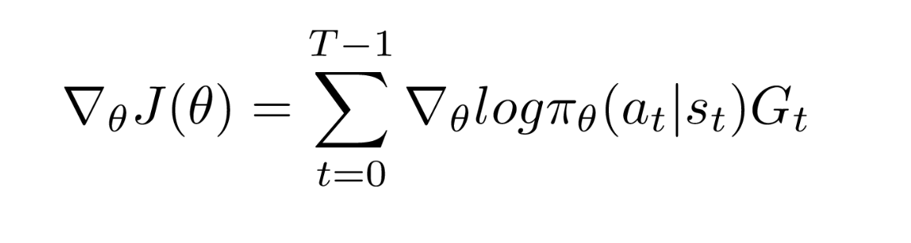
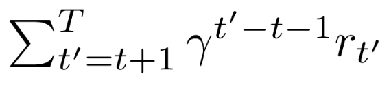

In the previous blog, we dived into the basic implementation of a deep Q-Learning Neural Network. It was a Policy-based duel- network which was used to learn the thief-police-gold game. Now, I have all of a sudden introduced two terms here, **Policy-Based, Duel-Network**. Policy-based methods are those which learns the probability distribution of the actions to take next of  being in a given state. As, it could be seen that we were using a softmax layer of output-size=**number of possible actions**, it was nothing but the policy-learning mechanism for the network to learn which action to take further depending on the probabilities. Moving on to the next term, **Duel-Network**. We had used two neural-networks in the previous blog, one which was used and updated in an online manner while the other was updated(not so often) and used for predicting the policy values for the new_state. The reason for that was to be able to maintain some sort of consistency and not induce much randomness in the poilcy-prediction for the new states which are used to update the current policy-values. 

Coming to this blog, I will be talking about a new term again 😀 and that is **Actor-Critic** Methods. The previous agent can be understood as the actor part of the actor-critic networks as it focuses on the policy-prediction. To be able to understand the critic part, we need to understand value-based networks. So, unlike policy based networks critic-network predicts the value of importance of being in a state(state-value) or for a action-state pair(q-value). In fact, reinforcement learning started with value-based networks  only and the policy-based learning was further derived using the equation of value-equation. 

**Let us go into some maths this time 😊:**

The main aim of a reinforcement learning algorithm is to maximise the reward considering the future actions and their rewards.
Mathematically this can be shown as :

Now that we have talked about the policy function earlier in this post, let us look into the mathematical expression of the gradients of the cost function J(\theta) required for updating the policy functions. We call them policy gradients. A very nice derivation of getting the gradients is given in this [blog](https://medium.com/@thechrisyoon/deriving-policy-gradients-and-implementing-reinforce-f887949bd63). If you feel curious, you can read it. So, the final expression for the gradient is as follows:

where G the sum of future discounted rewards:

