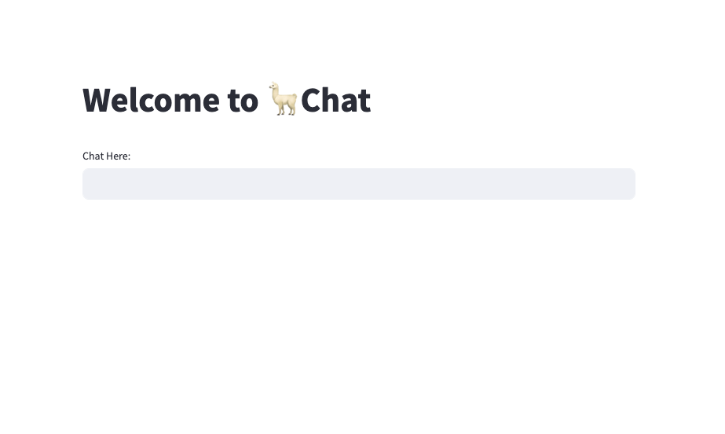

Ever wanted to create your very own chatbot, just like the ones you talk to on the internet? Well, you're in for a treat! In this blog, I'll guide you through the process using Llama-2 LLM.
But wait, there's more. I'll also help you design a cool and easy-to-use chatbot interface. We'll do this using Streamlit, which is a super user-friendly tool for making your chatbot look great.
Now, here's a key point: you'll need a computer with at least 16 GB of memory to make this work. Don't worry, though. I'll explain it all step by step, and the results will be fantastic!

## Serving the Llama-2 Model for Live Chat Generation
Before we can dive into building a chatbot interface, we need to get our Llama-2 model up and running. We want it to generate responses in real-time, just like the impressive ChatGPT. We will be building a simple FastAPI app which exposes an endpoint
for streamed text generation. Now, there can be cases when you don't usually have a powerful gpu machine like A-100s with 40/80 GB of memory. Thus, we will be loading the model in 4-bits. I will also show how to generate stream text using a LLM just 
like ChatGPT for better user experience. Now, lets get into the code part. Let's create a file named **serve_llama.py** for serving our 7b LLama model.


```python
import json
import torch
from fastapi import FastAPI
from fastapi.responses import StreamingResponse
from transformers import AutoModelForCausalLM, AutoTokenizer
from pydantic import BaseModel
from typing import Optional

checkpoint = "Llama2-7b-chat-hf/"
tokenizer = AutoTokenizer.from_pretrained(checkpoint)
model = AutoModelForCausalLM.from_pretrained(checkpoint,
                                    load_in_4bit=True,
                                    torch_dtype=torch.bfloat16,
                                    device_map="auto")

app = FastAPI()

class InputData(BaseModel):
    query: str
    tokens: Optional[int] = 400

def starts_with_space(token_id):
    token = tokenizer.convert_ids_to_tokens(token_id)
    return token.startswith('▁')

def live_answer(ask):
    input = tokenizer.encode(ask, return_tensors='pt')
    input_len = input.shape[1]
    generate = True
    output_length = 0
    while generate:
        output = model.generate(input, max_new_tokens=1,
                            do_sample=True, top_k=10,
                            temperature=0.5)
        current_token_id = output[0][-1]
        if current_token_id == tokenizer.eos_token_id:
            generate = False
            break

        current_token = tokenizer.decode(
            current_token_id, skip_special_tokens=True
        )
        if starts_with_space(current_token_id.item()) and output_length >= 1:
            current_token = ' ' + current_token
        yield current_token
        output_length += 1

        input = output

@app.post("/llama-7b/live_generate/")
async def live_generate(data: InputData):
    ask = PROMPT_TEMPLATE.format(instruction=data.query)
    text_data = live_answer(ask)
    return StreamingResponse(text_data, media_type="text/plain")
```

In the code above I first loaded the huggingface model in 4 bits which roughly should take 5GB of memory of your GPU. Note that this memory is just for loading the weights. 
Your gpu occupation and usage will increase as the requests are made to the model for generation. The **start_with_space** function takes a token id and returns whether the token starts with a special character **"▁"** or not. Note that
this is not the underscore character. This basically tells us whether the token is a start of a word or not. If the token generated is the starting token of a word, we need to add a space as a prefix to it before streaming it out. 

Now, let's serve our model by running the command as follows:

```bash
uvicorn serve_llama:app --host 127.0.0.1 --port 5001
```

Now that the model is served on the localhost on port 5001, let's start building a UI for our personal chatbot. We will be using streamlit which is a library in python to build the UI. We will be creating another python file named **llama_chat.py**
for the UI. The main thing to note while building a chatbot is storing the chat history so that the model remembers the context of the interaction with the user. We can use the session_state attribute in streamlit to store our chat prompt and chat history. We will be using the default prompt format on which the Llama-2 model was trained which is as follows:

```python
llama_prompt = """[INST] <<SYS>>
    {system_prompt}
    <</SYS>>
 {instruction} [/INST] """
```

System prompt defines the role of the model and instruction defines the input given to the model. We will be defining the system prompt such that it takes up a role of a AI assistant and in the instruction, we will be passing the history of the conversation along with the user's latest input. Let's delve into the code to see how it's done. 

```python
import streamlit as st
import json
import requests

if "chat_prompt" not in st.session_state:
    st.session_state["chat_prompt"] = """[INST] <<SYS>>
    You are a AI assistant interacting with the user. Based on the history and the new instruction,
interact with the user and fulfil the user's request.
    <</SYS>>
    {history}
    
    {instruction} [/INST] """

if "history" not in st.session_state:
    st.session_state["history"] = {"instructions": [],
                                  "responses": []}

def generate_answer(ask):
    model_url = "http://localhost:5001/llama-7b/live_generate/"
    data = {
        "query": ask
    }
    response = requests.post(model_url, json=data, stream=True)
    if response.status_code == 200:
        for chunk in response.iter_content(chunk_size=64):
            yield chunk.decode()

if __name__=='__main__':
    st.title("Welcome to 🦙Chat")
    chat = ""
    for i in range(len(st.session_state["history"]["instructions"])):
        chat += "**You: " + st.session_state["history"]["instructions"][i] + "**\n\n"
        chat += "**🦙:** " + st.session_state["history"]["responses"][i] + "\n\n"

    st.write(chat)
         
    user = st.text_input("Chat Here:")
    if user:
        history = ""
        for i in range(len(st.session_state["history"]["instructions"])):
            chat += st.session_state["history"]["instructions"][i] + "[/INST] "
            chat += st.session_state["history"]["responses"][i] + "[INST] "

        ask = st.session_state["chat_prompt"].format(history=history, instruction=user)

        output = st.empty()
        olist = []
        for w in generate_answer(ask):
            olist.append(w)
            output.write("".join(olist))

        st.session_state["history"]["instructions"].append(user)
        st.session_state["history"]["responses"].append("".join(olist))

```

Now, let's run the UI app using the command as follows:

```bash
streamlit run llama_chat.py --server.port 8501
```

The UI should be up and running on the url=**http://127.0.0.1:8501**

Let's see how it looks like:



Hurray! Seems like we did it all right. Now, let's chat with it for a while. I will be using a set of selected queries to see the overall ability of this chatbot.
Refer to the video below to see how it works.

<iframe width="560" height="315" src="https://www.youtube.com/embed/lwTfRSy_uqY?si=jBnIIAV75uBfGTN7" title="YouTube video player" frameborder="0" allow="accelerometer; autoplay; clipboard-write; encrypted-media; gyroscope; picture-in-picture; web-share" allowfullscreen></iframe>

Amazing! Isn't it 🤩

## Conclusion
Building your chatbot is a journey of creativity, problem-solving, and learning. The benefits are abundant, from enhanced user engagement to automation and scalability. By taking the reins and crafting your chatbot, you gain the ability to provide tailored solutions and create a unique, engaging experience for your audience. Whether for business or personal use, your custom chatbot is a powerful tool that can open doors to efficiency, innovation, and endless possibilities. So, why wait? Dive in and start reaping the rewards of your very own chatbot today!

Until then, Keep learning, Keep Sharing!

## References
- https://huggingface.co/meta-llama/Llama-2-7b-chat-hf
- https://docs.streamlit.io/
- https://arxiv.org/pdf/2307.09288.pdf
