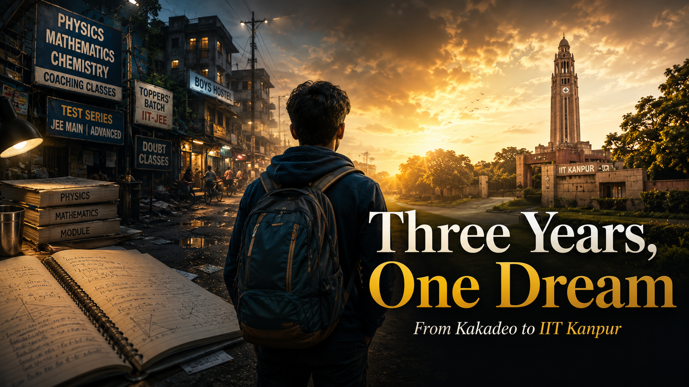

Hey everyone, this is Praphul.

Are you from Kanpur? Have you ever lived in Kakadeo, attended coaching classes there, or spent your teenage years chasing the IIT dream?

Then perhaps some parts of this story will feel familiar.

I spent three important years of my life in Kanpur. I completed Classes XI and XII under the CBSE board and prepared for IIT JEE in Kakadeo, the famous coaching hub of the city.

Those three years gave me memories that I may never be able to recreate. The friends, the teachers, the hostels, the classrooms, the streets, and the city itself became part of my life.

What a life it was.

Kanpur taught me much more than Physics, Chemistry, and Mathematics. It taught me how to live independently, how to make difficult decisions, how to handle failure, and how to continue working when nothing happens according to plan.

There is another reason I am writing this long post.

I want students preparing for competitive examinations to understand what it takes to follow a dream. I also want them to know how it feels when your hard work does not produce the result you expected.

And buddy, Kanpur is not Kota.

It has its own style, its own rhythm, and its own way of testing you. If you are an outsider and have nobody to guide you, you may struggle a lot.

I was an outsider.

I had nobody to guide me.

And yes, I struggled too.

I hope my story helps someone who is standing where I once stood.

Before beginning, I want to dedicate this story to my parents, my brother, my teachers, and my friends: Deepak, Dhanraj, Dilip, Gaurav Puri, Utkarsh, Sajal, Kushagra, Manish Bhaiya, Krishna Bhaiya, Dharmveer, and many others who became part of this journey.

So, without wasting any more lines, here we go.

## My First Step into the City

It was 15 May 2012.

After saying a painful goodbye to my family in the small town of Nichlaul, I left for Kanpur alone.

I had almost nothing with me except a bag filled with clothes and, of course, an ATM card. At that age, the ATM card felt like an important symbol of independence, even though I had no idea how difficult independence was going to be.

I arrived at Kanpur Central railway station at around 11 at night.

From there, I took an auto to Rawatpur Crossing, where my friend Alok Mishra was waiting for me. We walked towards his hostel.

On the way, I noticed a huge building covered with bright lights and posters. I asked him what it was.

“That is Rave Moti,” he said.

It was a shopping mall.

That was my first introduction to such a world. I had come from a small town, so even seeing a large, shining mall at night felt like entering a different country.

That night was also my first experience inside a hostel room. The room was small, crowded, and owned by someone so strange that I knew I would not be able to stay there for long.

Mishra Ji was also from Nichlaul. Like thousands of other students in Kanpur, he had come there to prepare for the famous IIT JEE.

At that point, I was completely confused.

I did not know which coaching institute to join, which teachers were good, where I should stay, or how the entire system worked.

Kakadeo was known as a coaching market, or, as people called it in Hindi, a *coaching mandi*. Every street had institutes, advertisements, agents, hostels, and people claiming to offer the best guidance.

For a new student, it was difficult to know whom to trust.

For the first three days, I simply explored the city. I walked through the streets, visited JK Temple, and spent time in an air-conditioned mall for the first time in my life.

JK Temple looked less like a temple and more like a meeting point for couples. Perhaps that was appropriate because it was a temple of Lord Krishna.

You know what I mean.

After three days of roaming around, I finally asked Mishra Ji to take me to his Physics class.

The institute was called **QUARK**.

Please remember that name.

It was a very small institute, but I had already decided that I needed to start somewhere.

That was where I met Mr Anant Agnihotri, the teacher who would later become my Physics guru.

I gathered some courage and asked him:

> “Sir, do you teach school-level Physics here or IIT JEE-level Physics?”

He looked at my confused face and smiled.

> “Beta, attend one or two classes first and then decide. We begin with the basics and gradually reach the level required for IIT JEE.”

The next day, I attended my first Mechanics class.

By the end of the lecture, I felt relieved.

I had found the right Physics teacher.

But the job was not complete. I still needed teachers for Mathematics and Chemistry.

Someone suggested M. Sahvan for Mathematics and G. D. Verma for Chemistry.

When I entered the Mathematics classroom for the first time, my reaction was simple:

> “Whoa!”

I had come from a small town, and here I was sitting in a centrally air-conditioned classroom with impressive furniture and students who looked extremely confident.

During the class, the teacher asked whether the CBSE Class X results had been announced.

They had.

Nearly half the students had scored a perfect 10 CGPA. Only a few students, including me, had scored around 9 CGPA.

I looked around the room and thought:

> “Bro, this is going to be very difficult.”

After the class, I decided to join the so-called foundation batch.

I called my father and asked him to bring my belongings. The next day, I searched for a room. After struggling for hours under the hot sun, I finally found one.

My father and brother arrived by evening.

My father met Anant Sir and, before leaving, said something very simple:

> “We have great hopes from you.”

He did not say much, but those words carried a great deal of weight.

After they left, I was full of confidence.

*Garam khoon hai bhai ka. Phod denge.*

I believed I was ready to conquer everything.

I was not.

## The Search for a School

The next challenge was finding a school.

I wanted a school where attendance was not treated as the most important thing in the universe. Since coaching and self-study were my priorities, compulsory attendance could become a serious problem.

Finding such a school with vacant seats was much harder than expected.

I visited Virendra Swaroop, MPEC, Jugal Devi, Kendriya Vidyalayas, Puranchand, and several others. None of them had seats available.

I also visited Sir Padampat Singhania Education Centre, located behind JK Temple.

It was an excellent school and also suitable for students preparing through coaching. For a moment, I thought my search was over.

Then I heard the admission fee.

For many families, the amount might have been manageable. For a boy from a typical middle-class family like mine, it was simply too much.

It would have burnt a hole through my pocket, my bag, and probably the entire room I was staying in.

I became worried.

One day, during Chemistry class, I met a boy named Deepak Gangwani.

At that time, he looked like a complete *champu*. Today, to my surprise, he has become a handsome hunk with many girls around him.

Life is unpredictable.

He sat beside me and asked:

> “How much did you score in the test?”

> “Fifty-six out of ninety-six,” I replied.

> “Okay. I got sixty-six,” he said.

It sounded like a small attempt to show off.

My inner voice immediately responded:

> “Bro, I do not care.”

But that same boy later became one of the most loyal friends I have ever had.

Deepak asked about my background. When he learned that I was an outsider searching for admission in Class XI, he suggested that I take the entrance examination for Guru Nanak Public School with him.

In the next class, I met another interesting character, Gaurav Puri.

He was a little miserly, but he had a great heart.

Gaurav told me that attendance was compulsory at Guru Nanak Public School. Still, I had no better option.

So Deepak, my brother, and I went there, and I took admission.

## My First Day at School

My first day at school was memorable because it introduced me to people who later became like brothers to me.

It also introduced me to a few people who made life unnecessarily difficult.

We did not have the official school uniform yet, so all the new students arrived wearing plain white clothes.

As we entered the school, the other students stared at us as though we were ghosts walking through a crowd of living people.

Their confused expressions made us uncomfortable, but we continued walking as if everything was normal.

Every forty-five minutes, a new teacher entered the class. Each one had a different personality and a unique way of introducing themselves.

The most memorable entry belonged to our English teacher, Shakti Ma’am.

Her name meant power, and after a few days, I discovered that there was plenty of power in her hands too.

She entered the room and announced loudly:

> “Classes have been running since April, and many chapters have already been completed. I am not going to teach them again.”

I was not pleased.

Not even slightly.

The strange thing was that she later became quite impressed with me.

And naturally, I had no problem with that.

After all, she was not an old lady.

Uhmm, uhmm. No bad thoughts.

I simply wanted good marks without doing too much labour.

She helped me many times. She gave me full marks in oral examinations even when I had not attended them and supported many of my heroic attempts to remain absent.

I attended school on alternate days and almost always gave the same excuse.

My Class XI class teacher quickly understood my tricks.

Whenever I came to school, I was punished and made to stand outside the classroom for the first two periods.

Eventually, I began to enjoy those free periods.

In the first unit test, I scored only around 50 per cent.

That result was far below anything I had imagined.

During my first year, I had almost no emotional attachment to the school.

I swear.

## The Greed for Chocolate

A new chapter began in Chemistry class when we finally reached the Mole Concept.

Before that, we had spent an entire boring month studying nomenclature.

G. D. Verma Sir organised a class test. My friend and I scored 80 out of 80 and jointly stood first.

That was when I learned about an important rule in his class.

The top five students received chocolates.

I got a Cadbury.

At that age, even a small chocolate felt like a medal.

But Sahvan Sir offered something much bigger. He announced a prize of ₹500 for the student who secured first place in his Mathematics test.

Sadly, I could not win it. In fact, I finished far behind the top rank.

Many things were happening differently from what I had expected. The results were beginning to demoralise me.

But *apne andar ka bhai abhi bhi garam tha*.

Mathematics and Physics were the subjects I enjoyed most. Chemistry did not interest me much in Class XI.

Still, for the sake of chocolates, I somehow remained among the top five.

Motivation can come from unexpected places.

## Friend or Target?

Around this time, I met Utkarsh Katiyar in Mathematics class.

He was a talented student and a good person. He later joined the National Defence Academy and went on to serve the country.

We became close friends, but one incident created bitterness between us.

Sahvan Sir organised a series of three Calculus tests. He announced that the top five students would join him for a treat at Landmark Hotel and a visit to IIT Kanpur.

We were extremely excited and prepared seriously.

I finished fifth.

Although I qualified for the trip, I was deeply disappointed with my rank.

I hate losing. Even today, very few things disappoint me more.

After the result, I stopped talking to everyone, including Utkarsh and Deepak, who had secured third and fourth positions.

Utkarsh misunderstood my silence.

He thought I was unhappy because he had scored better than me.

When he confronted me, I smiled, hugged both of them, and explained that I was not upset about their success. I was only disappointed with my own performance.

A few days later, Sahvan Sir gave Sajal, Kushagra, Utkarsh, and Deepak an interesting proposal.

He asked them to move into the hostel attached to the institute so that he could give them personal attention.

Sajal and Kushagra refused immediately. Utkarsh and Deepak agreed.

At first, I stayed away from the discussion. My relationship with Sahvan Sir was mostly limited to Mathematics problems. I did not involve myself in other matters.

Then Utkarsh recommended my name.

Sahvan Sir called me and offered me a place in the hostel.

I was unsure, so I asked for time to discuss it with my parents. They agreed. I even went with Utkarsh to his home, where we convinced his parents too.

Utkarsh and Deepak moved into the hostel.

Only then did I learn about one important condition.

I would have to leave my Physics and Chemistry classes and depend entirely on self-study.

Self-study is valuable, but I had not yet completed the full IIT JEE syllabus. I still needed guidance from my teachers.

Suddenly, I had to choose between staying with my friends and protecting my preparation.

It was a serious decision.

I spoke to Anant Sir. He strongly advised me not to leave my classes.

After thinking carefully, I said no to the hostel proposal.

Utkarsh stopped speaking to me.

Deepak remained a close friend, but I knew my decision had damaged my friendship with Utkarsh.

I hoped I would eventually convince him.

For the moment, I decided to concentrate on my target.

## The Hundred-Rupee Question

One of my most memorable moments happened during a Physics class.

Anant Sir wrote a Mechanics problem on the board and announced:

> “Whoever solves this within three minutes will get a hundred-rupee note.”

The atmosphere changed instantly.

Everyone sat upright. Hearts began beating faster.

Even inside the air-conditioned classroom, I started sweating.

I wanted that hundred-rupee note.

Not because I desperately needed the money, but because it could pay for a good treat.

The timer started.

Our pens moved like a storm. For those three minutes, the classroom disappeared. The other students disappeared. The entire world disappeared.

Only the question remained.

When the time ended, three hands went up: mine, Dhanraj’s, and Sajal’s.

Each of us explained our answer and method.

Mine was correct.

I won the note.

That small victory gave me something more valuable than ₹100. It gave me the belief that I could become someone special, at least for myself, my parents, and my teachers.

Every person has abilities that remain hidden until the right moment brings them out.

From that point, I began giving my best in every test. Even when I finished second or third, I stayed motivated and tried to reach first place.

Eventually, I achieved that goal in a Fluid Mechanics test. I scored 100 out of 140 and stood first.

During Class XI, I also began strengthening my concepts through H. C. Verma’s *Concepts of Physics*.

Whenever I skipped school, I sometimes spent five to seven hours studying Physics alone.

Chemistry, unfortunately, continued to receive very little attention.

That imbalance would later cost me.

## Do Not Be Partial, Become Complete

Someone once told me:

> “If you are good at two subjects, you may get selected. But if you want a good rank, you must become strong in all three.”

That sentence stayed with me.

As I mentioned earlier, Chemistry was not a subject I enjoyed. Sometimes I feared that it would prevent me from clearing the examination.

Anant Sir suggested that I join Pankaj Sir’s Chemistry classes.

Since Chemistry was clearly my weakest area, I entered Class XII determined to master it.

There were two teachers, Pankaj Sir and Nirmal Sir.

They taught so well that, within a year, my fear slowly began turning into confidence.

I was finally learning that ignoring a weakness does not make it disappear. You have to face it directly.

## Managing Boards and JEE

The Class XI results were announced, and fortunately, I stood first.

That day, the school Chemistry teacher who had punished me throughout the year came to me and said:

> “Mr Praphul Singh, I do not care whether you attend school or not. The only thing I need from you is the result.”

My reaction was immediate:

*Main to yahi chahta tha.*

Class XII was the real challenge.

Now I had to manage both the board examinations and IIT JEE.

Around this time, I became friends with Dhanraj Naikwade. He was a brilliant student and a genuinely kind person.

Later, I moved into his hostel in R. S. Puram.

Dhanraj was cooperative and treated me like a brother.

One incident involving him still makes me emotional.

I once lost his bicycle.

It was not just an ordinary bicycle. His father had given it to him as a birthday present.

When I told him, he gave me a sad smile and tried to hide his tears. Seeing him struggle to control his emotions made me feel terrible.

On happier days, I loved listening to him speak to his family in Marathi over the phone.

His Chemistry, especially Organic Chemistry, was excellent. We sat together in class, discussed problems, and studied late into the night, sometimes until four or five in the morning.

Those discussions improved my Chemistry more than I realised at the time.

When Dhanraj eventually left the hostel, it was an emotional moment for me.

Still, the preparation had to continue.

My brother, Prashant Singh, played the most important role in my studies.

At every step, he corrected me, criticised me, pushed me, and encouraged me as much as he could.

He did not allow household work to disturb my preparation. He washed my clothes and brought breakfast for me every morning.

It is easy to praise the person who succeeds. We often forget the people who quietly make that success possible.

My brother was one of those people.

The atmosphere in the new hostel was perfect for studying.

Manish Bhaiya, who was in my batch and became like an elder brother, regularly discussed difficult problems with me.

During Class XII, I began topping many Physics and Mathematics tests. Chemistry was improving, but I still lacked complete confidence in it.

My friendship with Sajal and Kushagra also grew stronger.

Sajal and I frequently challenged each other with difficult questions. Those discussions became our small research sessions in Physics, Chemistry, and Mathematics.

I also met Krishna Bhaiya and his younger brother, Anoop, who was preparing for the same examination.

Anoop owned a large collection of books by authors such as A. M. Agarwal, S. K. Goyal, D. C. Pandey, and several Cengage Learning publications.

Seeing those books changed my preparation strategy.

Until then, I had focused mainly on coaching assignments. I now began solving standard books and exploring problems beyond the material provided in class.

I was the youngest person in the hostel, and everyone treated me like a younger brother. Nobody disturbed me while I studied.

At school, the teachers had also stopped troubling me about attendance. As a result, I attended very few classes that year.

My performance continued improving in Mathematics and Physics. Chemistry was better too, but the confidence was still missing.

## The Board Examinations

My board examinations began on 1 March.

For the next twenty-four days, I completely shifted my focus from JEE to the boards.

Manish Bhaiya helped me a lot. He had been a board topper himself and guided me on how to prepare intelligently.

I followed his advice carefully.

The board examinations ended on 24 March.

I now had only ten days before JEE Main.

My brother went to Aligarh so that I could study without any distractions. I created a detailed plan and prepared for the examination as systematically as possible.

On the day of JEE Main, the examination centre was crowded and tense.

More than five hundred students were present.

The examination began at 9:30 in the morning.

I was extremely nervous.

When the question paper reached my hands, they started trembling. Sweat covered my palms and forehead.

The first section was Mathematics.

The opening question was based on quadratic equations. It was easy, but I could not find the answer.

I wasted four minutes on it.

My heartbeat increased. Suddenly, I began doubting whether I could solve the remaining eighty-nine questions.

Then I remembered my teacher’s advice:

> “Attempt Chemistry first.”

I immediately changed my approach.

Within thirty to thirty-five minutes, I completed the Chemistry section. Then I moved to Physics and finally returned to Mathematics.

When I attempted the first question again, I solved it easily.

The pressure had made a simple question look impossible.

I completed the paper on time, but I made too many silly mistakes.

My score was 250 out of 360.

It was a decent result, but it was not satisfying.

## The Result That Broke Me

After JEE Main, I began preparing for JEE Advanced.

My preparation was going well, and finally, 25 May arrived.

I performed reasonably well in Paper 1, but I was not fully confident.

Chemistry continued to trouble me. My strengths in Physics and Mathematics carried me forward, but I knew my weak command over Chemistry could damage my rank.

At 5:00 in the evening, the examination ended.

There was nothing more I could do.

When the result was announced, I received an All India Rank of 7720.

I was shattered.

I cried secretly.

For some time, I felt like a person with no purpose, no ambition, and no destination.

More than my own disappointment, I felt that I had disappointed my parents and teachers.

I left the hostel and returned home.

My parents advised me to participate in counselling, but I refused. I believed that a general category rank of 7720 would not give me anything I genuinely wanted.

Then Anant Sir called me.

He said:

> “Praphul, you were born to do something great for your parents. Do not give up. Fight again.”

His words stayed in my mind.

After nearly a month, I decided to try once more.

## One More Attempt

For my second attempt, I joined Chemistry classes and decided to prepare Physics and Mathematics on my own.

By then, I had understood the weaknesses hidden behind my strengths.

My speed was good.

My efficiency was good.

But my accuracy was not.

I solved many questions, but I rarely analysed my mistakes properly.

Instead of returning to a hostel, I rented a two-room portion of a house and stayed there with three close friends.

The preparation started again.

This time, I practised at a completely different level. In one month alone, I solved more than 10,000 problems.

Anant Sir advised me to develop a more subjective and concept-oriented approach.

Following his advice, I began solving advanced problems from Cengage Learning, S. K. Goyal, A. M. Agarwal, Abhay Singh, and the distance-learning material from Bansal Classes.

To improve my accuracy, I joined test series from Bansal Classes, Resonance, and Utkarsh Gail Super 100.

The scores showed steady improvement.

Earlier, my competition had been limited to a few thousand students in Kanpur. Through national-level test series, I was now competing with students from across India.

That changed my mindset.

I became more ambitious.

In one test series, I reached All India Rank 7. In another test, I stood fifth in Physics. Several other strong ranks followed.

The Chemistry that had frightened me during my first attempt became almost as strong as Mathematics.

I stopped thinking too much about the final result.

I simply wanted to learn and collect as many marks as I could.

I did not study for fourteen or fifteen hours every day.

I studied for around seven or eight hours.

But those hours were honest.

There was concentration, discipline, and purpose behind them.

I also made a strategic decision. I skipped topics that were useful only for JEE Main and focused mainly on the Advanced syllabus.

This time, I scored 270 in JEE Main.

I was confident that I would secure a strong rank in JEE Advanced.

I hoped to finish within the top 200.

But life does not always follow our expectations.

## Three Fives

When the JEE Advanced result was announced, I received All India Rank 555.

It was not the rank below 200 that I had imagined.

Still, it was beautiful.

It was special.

There was something satisfying about those three fives.

After hundreds of tests, thousands of mistakes, more than a hundred thick notebooks, sleepless nights, hostel rooms, difficult friendships, moments of confidence, and moments of complete hopelessness, the dream had finally become real.

The ink spread across all those notebooks had finally shown its colour.

I had made it to IIT Kanpur.

## What Those Three Years Taught Me

My three years in Kanpur were not simply about preparing for an examination.

They were a collection of unforgettable moments.

Those years taught me that life will give you situations capable of defeating you, breaking you, and making you cry.

The same life can also teach you how to stand again.

It can guide you towards success, but only when you are willing to learn from your weaknesses.

My first attempt taught me that hard work alone is not always enough. You must analyse your mistakes.

It taught me that speed without accuracy can be dangerous.

It taught me that being excellent in two subjects cannot always compensate for ignoring the third.

It taught me that sometimes you must choose your target even when the choice affects your friendships.

Most importantly, it taught me that failure is not the end of the journey.

Sometimes, failure simply shows you how your next attempt must be different.

Those three years gave me teachers who guided me, friends who challenged me, brothers who supported me, and parents who continued believing in me even when I had stopped believing in myself.

This is the story of my three years in Kanpur.

A story of friendships, chocolates, hundred-rupee challenges, lost bicycles, examination halls, disappointments, second chances, and finally, three beautiful fives.

I hope you enjoyed reading it.

And if you are preparing for a difficult examination while feeling lost, remember this:

> A bad result can break your confidence, but it does not have the authority to decide your future.

Only you can decide whether the story ends there.

### Praphul Singh

### IIT Kanpur
